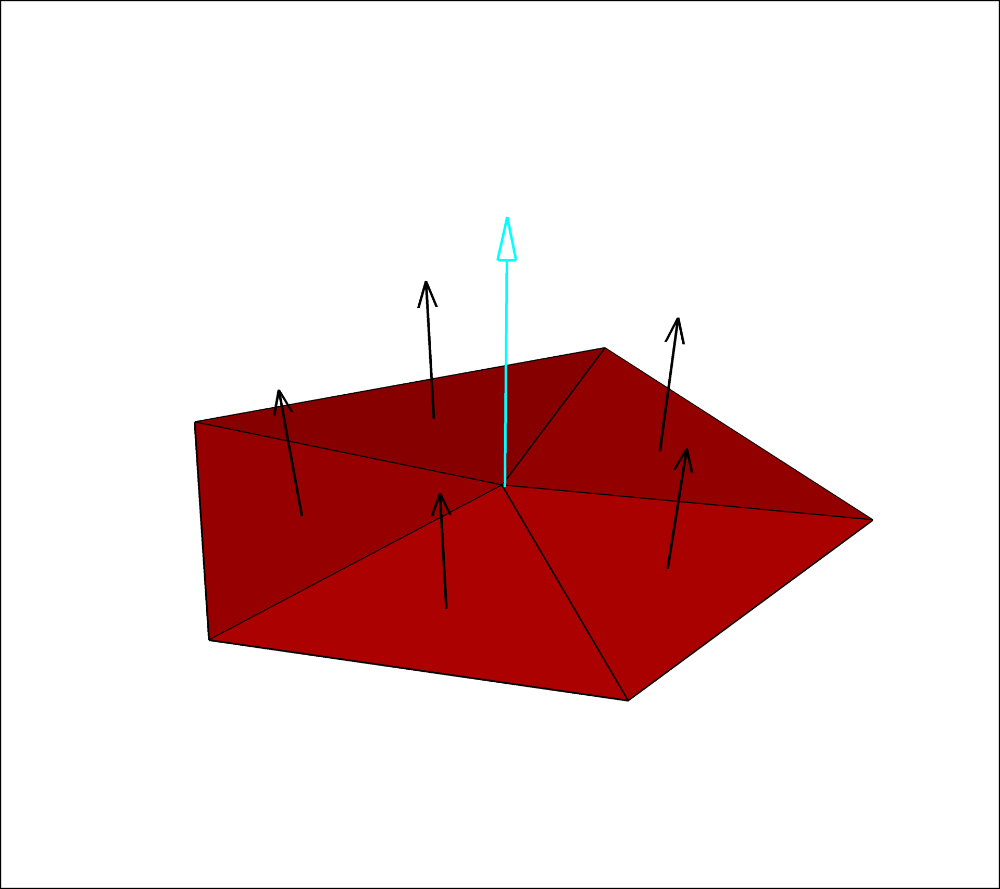
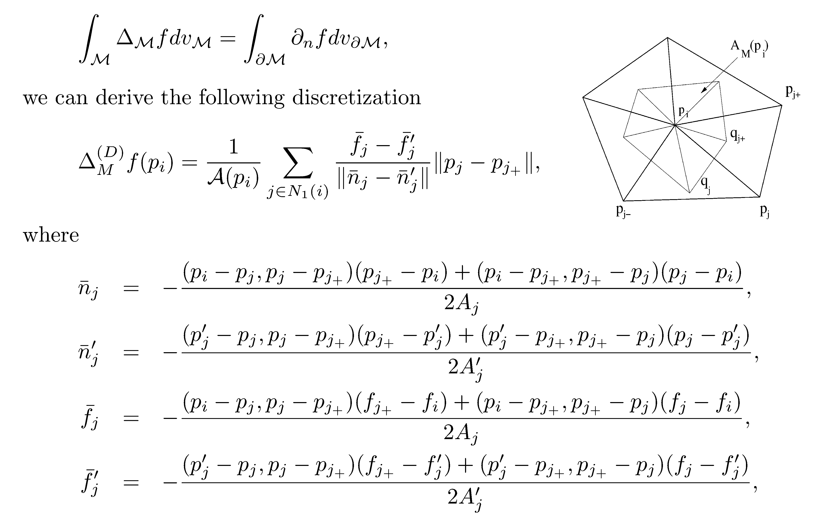
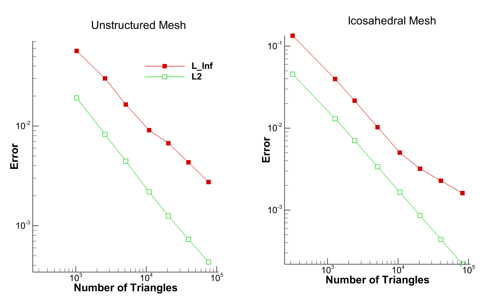
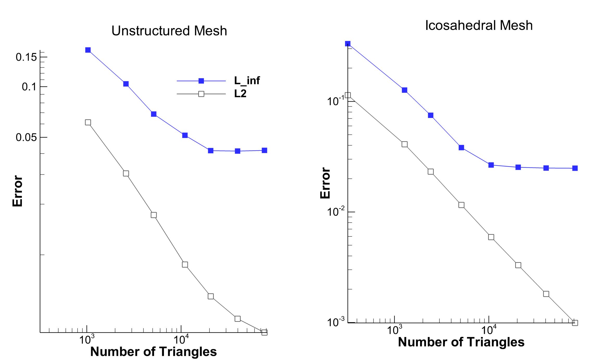
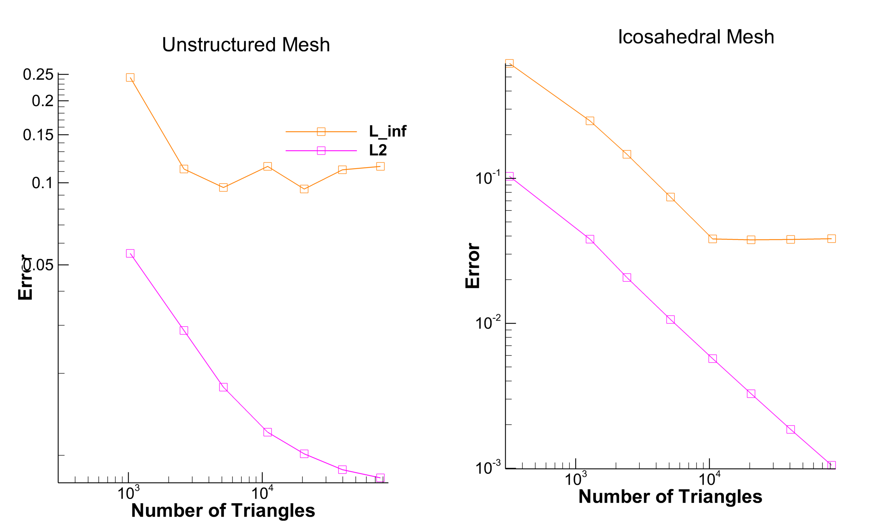
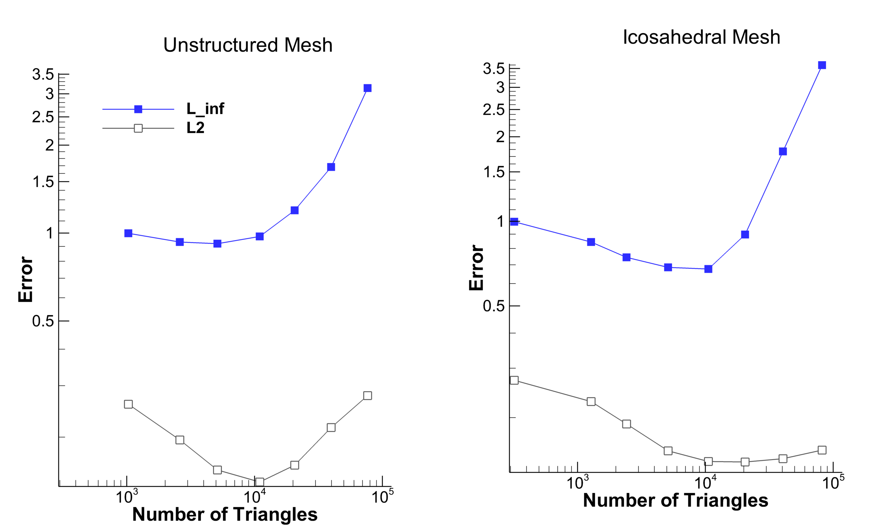
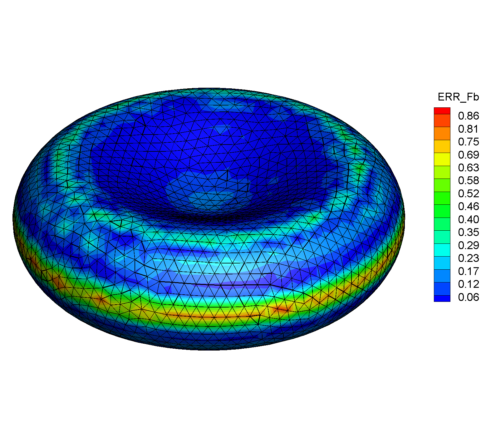
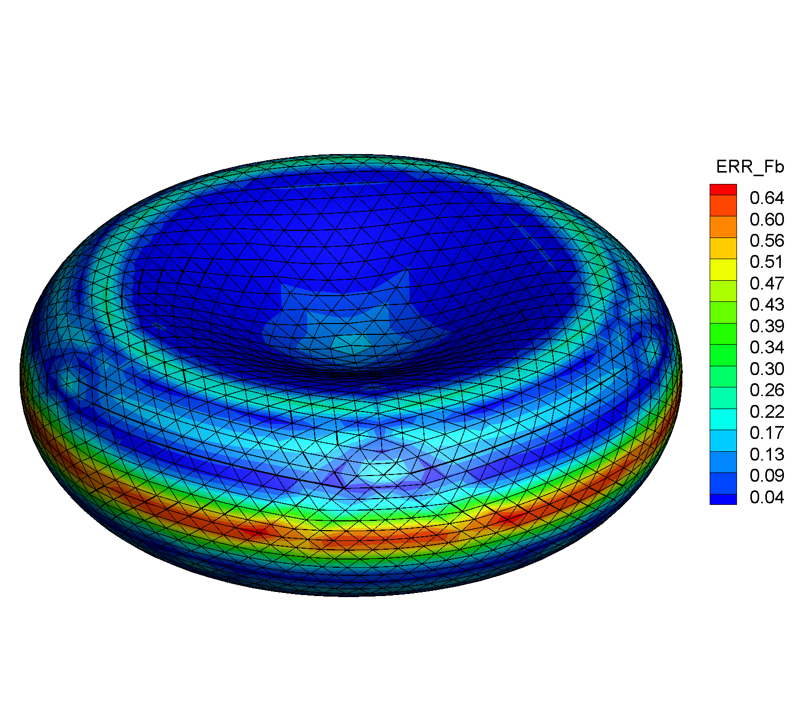
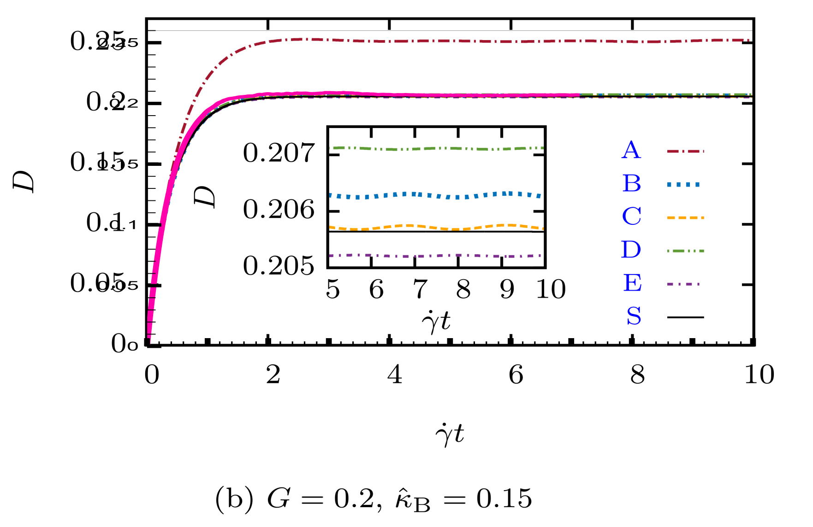
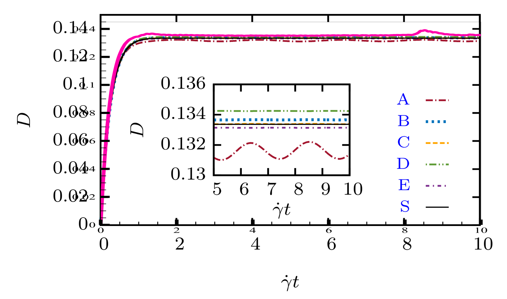

class: center, middle
# Computation of membrane bending forces
Abhilash Reddy M

---

# Bending Force

### Helfrich's Formulation

$$\bar{f}_b = E_b \left[(2H+H_o)(2 H^2 -2G -H_oH) + 2\Delta_s H\right]\bar{n} $$

--

If we assume that `\(H_o\)` is that of a plane(=0), we get:

$$\bar{f}_b = 2E_b \left[2H(H^2 -G) + \Delta_s H\right]\bar{n} $$

--

### Things that are needed:

- Normal Vector :  `\(\bar{n} \)`
- Mean Curvature: H
- Gaussian Curvature: G
- Surface Laplacian of H: `\(\Delta_s H\)`
##We will look at the convergence of each of these
---
#Red Blood Cell
The shape of a typical red blood cell is given by:
$$ z=\pm \frac{R}{2} \sqrt{1-\rho^2} \left( C_0+C_1\rho^2 + C_2\rho^4\right)$$


where `\(\rho = \frac{1}{R}\sqrt{x^2+y^2}\)`, and `\(C_0, C_1, C_2\)` are known constants. R is the length of the larger half axis. Here we take `\(R=1\)`.

--

- All the stuff from earlier can be analytically calculated for this surface.
- Axi-symmetry makes things a lot easier. 
- The error in the values computed on  succesively finer meshes is noted.

---
#Calculating the Analytical Values
```python
from sympy import *
r=symbols('r')
c0 = Rational(' 0.2072')
c1 = Rational(' 2.0026')
c2 = Rational('-1.1228')
#equation of the surface
z=(1/2)*sqrt(1-r*r)*(c0+c1*r*r+c2*r*r*r*r)

#take derivatives
dz = diff(z,r)
d2z= diff(dz,r)

b=sqrt(1+dz**2)
#normal components in the r and z directions
nr  = dz/b 
nz  = 1/b

G   = dz*d2z/(r*b**4)           #Gaussian Curvature
H   = (d2z/b**3 + dz/(r*b))/2   #Mean Curvature

dH  = z*diff(H,r)/b
d2H =-diff(dH,r)/(z*b)          #Laplace Beltrami of Curvature
```
Need to take one sided limits at r=0 and r=1


---
# Discretized surface

The surface is discretized using flat triangles.


---
#Mesh Generation

The  mesh is generated by two methods:
- By applying the equation from earlier on a triangulation of a sphere.
  - fast and simple to implement.
  - 5,6 vertex neighbors guaranteed.
  - cannot deal with any different topologies.
  - triangles get squeezed.

--

- Direct generation using Marching Cubes and equilibration (DistMesh).
  - Extremely general, but more complicated.
  - Uses a distance function field to generate the surface.
  - Topology is a non-issue.
  - Better quality triangles.
  - ~5 to ~9 vertex neighbors.

---

# Calculating Normal vector
- Face Normals are well defined for a flat triangle mesh. 
- Not the case for Vertex Normals.

--
  <p align="center">
  
  </p>
- Take weighted average of the face normals that surround a vertex.
- There are options for the weights. Simplest is to use no/equal weight.
- The chosen scheme gives the exact normal for a sphere, regardless of the triangulation. 

---
#Methods for computing Curvatures
We want per-vertex curvature. Element wise curvature could have been calculated using the line integral trick over each triangle.

- **Patch fitting based methods**:
  - Quadric: including or excluding normals.
  -  Cubic & higher order: including normals.
  - High accuracy.
  - Need sufficient neighboring vertices, otherwise more neighbors needed
  - Slow. Need to solve a least square problem at each vertex. No guarantee on the conditioning of the linear system.
- **Discrete Methods**:
  -  Cotangent Scheme: Diverges under certain conditions.
  -  `\(\Delta\bar{n}\)` method: Very robust and comparable accuracy to fitting methods

---

# Laplace Beltrami Computation
  <p align="center">
   
  </p>

---


# Convergence
###Normals
 

---

# Convergence
###Mean Curvature
 
---

# Convergence
###Gaussian Curvature
 
---

#Convergence 
###Bending Force
 
---
# Bending Force

###Error in Force



---
#Bending Force
<p align="center">

</p>
---
#Validation
###In-plane Forces only
<p align="center">

<p/>
---
#Validation
###With bending
 

---
class: center, middle
#Thanks